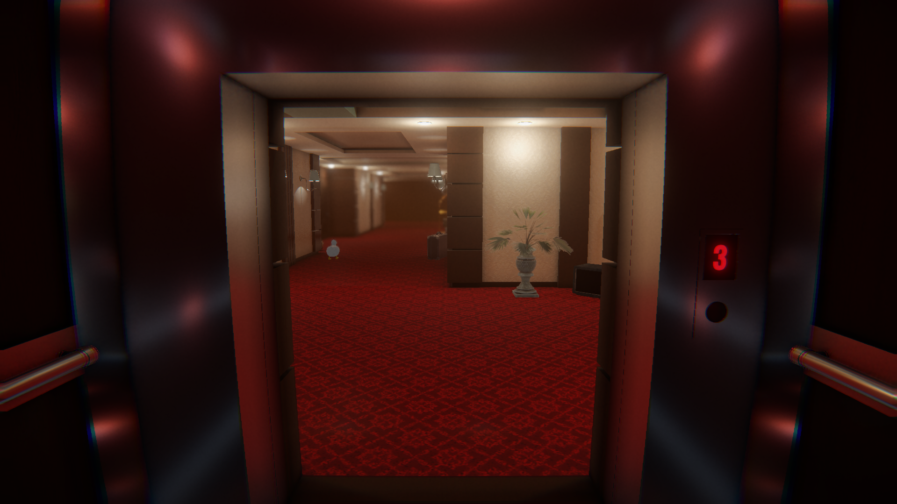
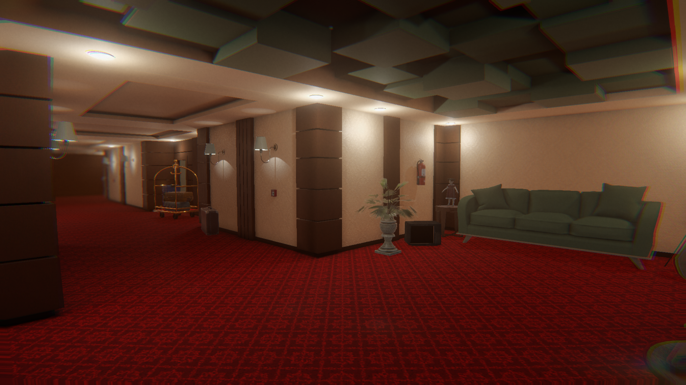
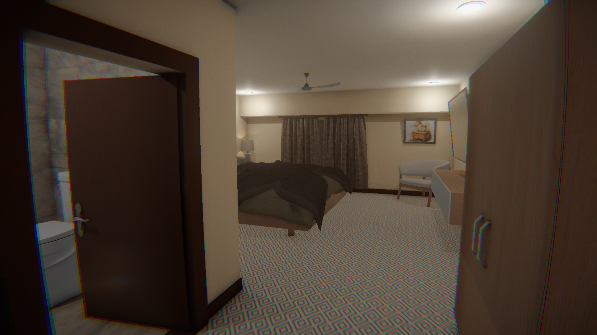

# Reality Distortion


**Reality Distortion** is a **first-person psychological horror game** where perception is your only defense.  

> A single missed detail can send you deeper into the distortion.

The player navigates through an unsettling environment filled with **subtle and overt anomalies**, deciding at every floor whether reality is stable — or dangerously wrong.

## In-Game Screenshots

<p align="center">
  
</p>

<p align="center">
  
</p>

<p align="center">
  
</p>

---

## 🎮 Core Concept

Reality Distortion focuses on **attention, memory, and environmental awareness** rather than combat.

- Observe the environment carefully  
- Detect visual, audio, and behavioral anomalies  
- Make decisions based on perception, not intuition  
- One wrong choice leads to failure and resets progression  
- First-person exploration  
- Randomized anomaly spawning  
- Decision-based progression system  
- Psychological tension through atmosphere and uncertainty  

The game challenges the player to **trust their senses** in an environment designed to deceive them.

Each floor introduces new possibilities for distortion, forcing the player to constantly reassess what is _normal_.

## 🧩 Anomaly System

Anomalies are designed to be **modular and extensible**.

### Types of anomalies
- Visual changes (objects missing, misplaced, duplicated)
- Audio disturbances
- Environmental transformations
- Animated or behavior-based anomalies

### Technical approach
- Anomalies implement a shared interface (`IActivatableAnomaly`)
- Centralized anomaly management system
- Easy to add new anomalies without modifying core gameplay logic

This architecture allows the game to scale naturally as new content is added.

## Technologies Used

- **Unity** (URP – Universal Render Pipeline)
- **C#**
- **TextMesh Pro**
- **Unity New Input System**
- First-person controller setup
- Modular gameplay architecture

## Project Structure

The project follows a clean and organized Unity structure:

```
Assets/
├── Scripts/
│   ├── Core systems (managers, controllers)
│   ├── Anomalies/
│   └── Interfaces
├── Scenes/
├── Prefabs/
├── Audio/
├── Models/
└── UI/
```

The codebase is structured to emphasize **readability, modularity, and future extensibility**.

## Project Status

**Completed academic project**

This project was developed as part of a university team assignment.  
While the core gameplay and systems are fully implemented, future updates or extensions are not guaranteed.

---

## ▶️ How to Play

1. Go to the **[Releases](../../releases)** page on GitHub
2. Download the latest build for Windows
3. Extract the archive
4. Run the executable

## Why This Project

This project was built to explore:
- Psychological horror design
- Player perception and environmental storytelling
- Modular gameplay systems in Unity
- Clean and scalable C# architecture for games

It serves both as a **game prototype** and a **technical portfolio project**.

---

## Credits

This project was developed collaboratively by a student team as part of a university assignment.  
All core systems, gameplay mechanics, and assets were created and integrated through team effort.


## 🤝 Contributing

Contributions, suggestions, and feedback are welcome.   Feel free to open an issue or a pull request.
